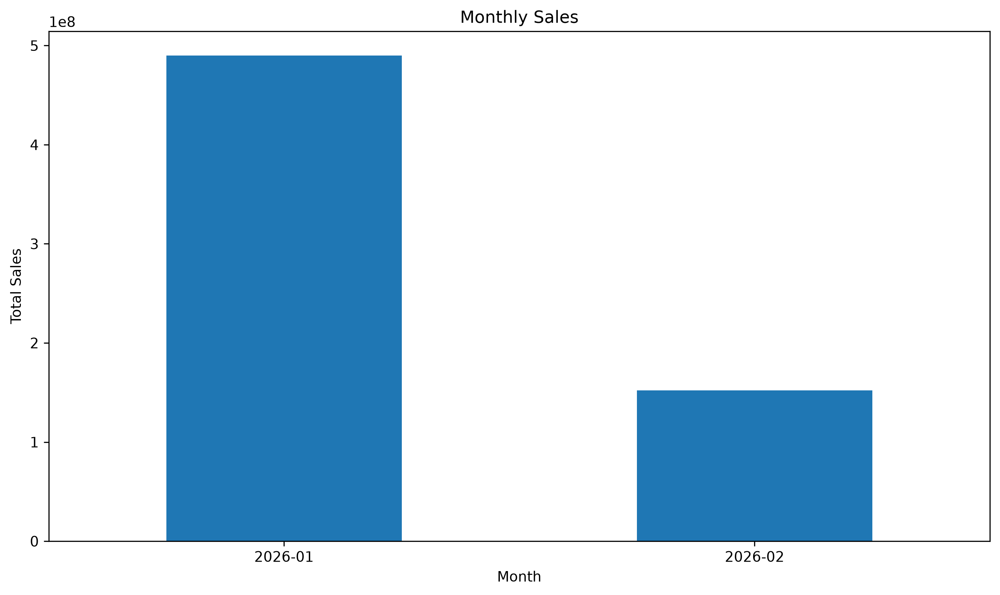
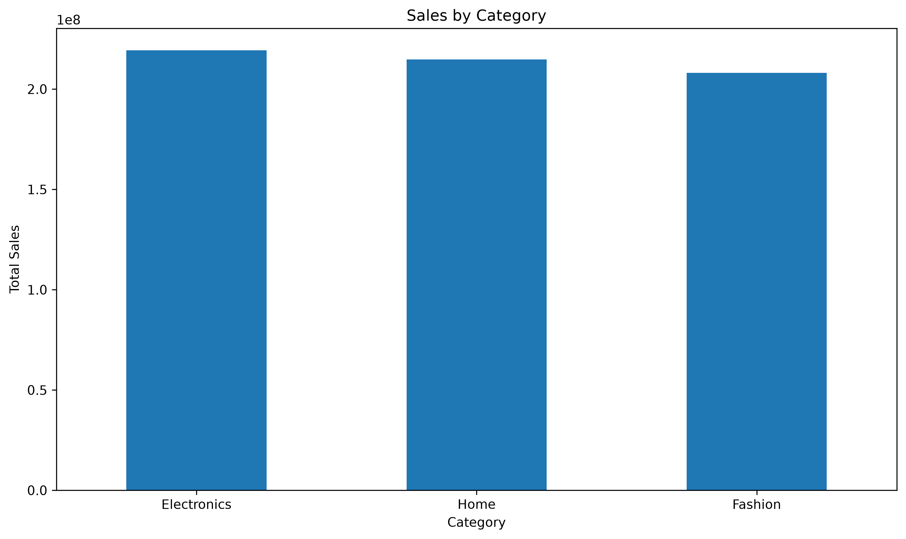
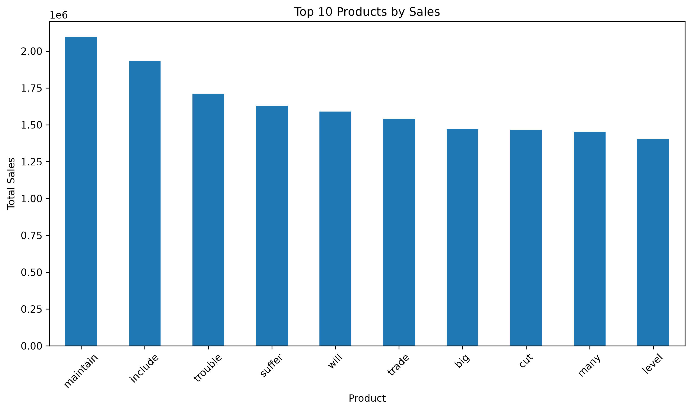
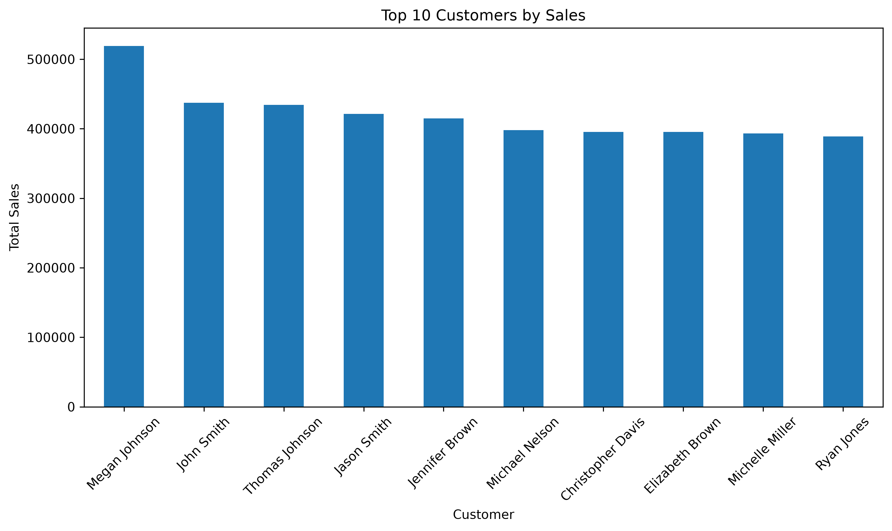
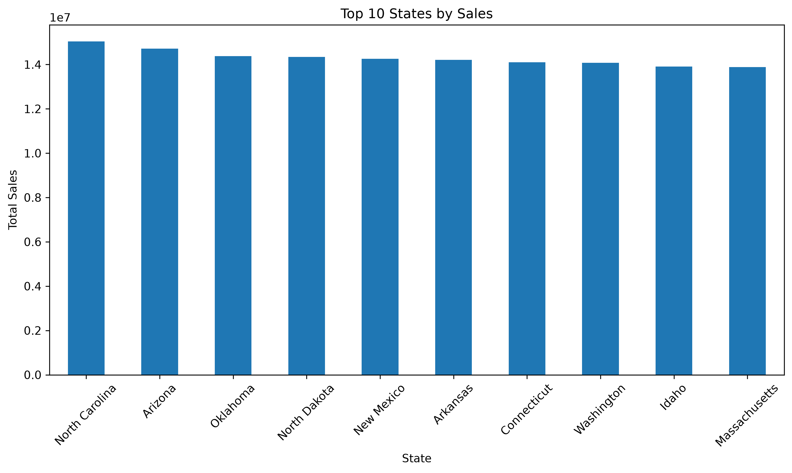
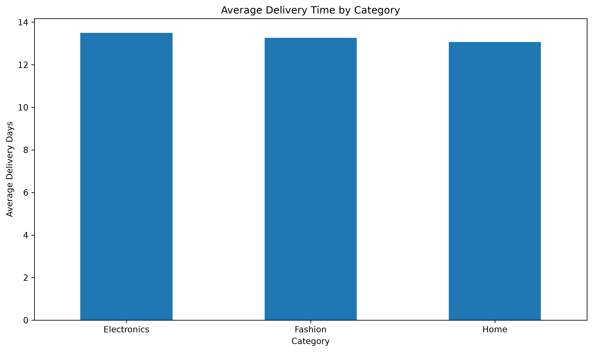

# E-commerce Sales Performance Analytics

## 📌 Project Overview

This project analyzes **10,000 e-commerce transactions** to evaluate sales performance, customer behavior, product and brand performance, geographic markets, payment methods, and delivery operations.

The analysis was developed using **Python, Pandas, and Matplotlib** and follows an end-to-end data analytics workflow:

**Data Loading → Data Cleaning → Data Quality Validation → KPI Calculation → Exploratory Analysis → Business Analysis → Visualization → Result Export**

The objective is to transform raw transactional data into **meaningful business insights and actionable recommendations** that can support data-driven decision-making.

---

## 🎯 Business Objectives

The project answers key business questions such as:

* What is the total sales revenue?
* How many orders and customers are recorded?
* What is the Average Order Value (AOV)?
* How many products were sold?
* What percentage of customers are repeat customers?
* Which product categories generate the highest sales?
* Which products and brands perform best?
* Which customers generate the most revenue?
* Which states contribute the most sales?
* Which payment methods contribute the most sales?
* How do sales change over time?
* How do discounts relate to sales?
* How does order quantity relate to sales?
* What is the average delivery time?
* Which categories and payment methods have longer delivery times?
* What is the relationship between shipping cost and delivery time?
* What relationships exist between quantity, price, discount, shipping cost, and sales?

---

## 🗂️ Dataset

The dataset contains **10,000 e-commerce transactions** and **21 columns**.

### Main Data Fields

| Column           | Description                       |
| ---------------- | --------------------------------- |
| `order_id`       | Unique order identifier           |
| `order_date`     | Date when the order was placed    |
| `ship_date`      | Date when the order was shipped   |
| `delivery_date`  | Date when the order was delivered |
| `order_status`   | Current order status              |
| `customer_id`    | Unique customer identifier        |
| `customer_name`  | Customer name                     |
| `country`        | Customer country                  |
| `state`          | Customer state                    |
| `city`           | Customer city                     |
| `product_id`     | Product identifier                |
| `product_name`   | Product name                      |
| `category`       | Product category                  |
| `sub_category`   | Product sub-category              |
| `brand`          | Product brand                     |
| `quantity`       | Quantity ordered                  |
| `unit_price`     | Price per unit                    |
| `discount`       | Discount applied                  |
| `shipping_cost`  | Shipping cost                     |
| `total_sales`    | Total sales amount                |
| `payment_method` | Payment method                    |

---

## 🛠️ Tools & Technologies

* **Python**
* **Pandas**
* **Matplotlib**
* **CSV**
* **Data Cleaning**
* **Exploratory Data Analysis (EDA)**
* **KPI Analysis**
* **Business Analysis**
* **Data Visualization**
* **Correlation Analysis**
* **Data Quality Validation**

---

# 🔄 Project Workflow

## 1. Data Loading

The project loads the e-commerce CSV dataset using Pandas.

The Python script automatically determines the project directory using the `os` module instead of relying on a hardcoded absolute file path.

This makes the project easier to run across different environments.

---

## 2. Data Cleaning & Preparation

The project performs several data-quality and preparation steps:

* Checks duplicate records
* Removes duplicate rows
* Converts date columns into datetime format
* Checks missing values
* Removes records missing essential information
* Checks invalid numerical values
* Removes invalid sales, quantity, price, and shipping records
* Calculates delivery days
* Creates a monthly analysis column

These steps help improve the reliability and consistency of the analysis.

---

## 3. Data Quality Validation

After cleaning, the project performs final validation by checking:

* Final number of rows
* Number of rows removed
* Number of columns
* Remaining duplicate records
* Remaining missing values
* Valid delivery records

This ensures that the cleaned dataset is suitable for business analysis.

---

# 📊 KPI Analysis

The project calculates key performance indicators to measure overall business performance.

## KPI Results

| KPI                        |    Result |
| -------------------------- | --------: |
| Total Sales                |   642.13M |
| Total Orders               |    10,000 |
| Total Customers            |     6,016 |
| Average Order Value        | 64,212.91 |
| Average Delivery Days      |     13.28 |
| Total Quantity Sold        |    30,144 |
| Average Items per Order    |      3.01 |
| Repeat Customer Percentage |    46.21% |

The KPI summary is also exported as:

`outputs/kpi_summary.csv`

---

# 👥 Customer Analysis

Customer analysis evaluates purchasing behavior and customer value.

The project analyzes:

* Orders per customer
* Repeat customers
* Repeat customer percentage
* Top customers by sales

### Key Finding

The dataset contains **6,016 customers**, with a **46.21% repeat customer percentage**.

The highest-value customer in the analysis was:

**Megan Johnson — approximately 519.13K in sales**

This highlights the importance of identifying and retaining high-value customers.

---

# 🛍️ Product & Category Analysis

Sales performance is analyzed across:

* Categories
* Sub-categories
* Products
* Brands

## Category Sales

| Category    | Total Sales |
| ----------- | ----------: |
| Electronics |     219.36M |
| Home        |     214.76M |
| Fashion     |     208.01M |

### Key Finding

**Electronics** was the highest-selling category with approximately **219.36M** in sales.

The three major categories performed relatively closely, indicating that sales are distributed across multiple product categories rather than being concentrated entirely in one category.

---

# 🏷️ Brand Analysis

The project identifies the highest-performing brands based on total sales.

### Top Brand

**Johnson and Sons — approximately 1.19M**

Other high-performing brands included:

* Smith Ltd — approximately 1.18M
* Smith and Sons — approximately 1.01M
* Jones and Sons — approximately 996K
* Martinez and Sons — approximately 958K

The complete brand analysis is available through the generated charts and analysis outputs.

---

# 🛒 Top Product Analysis

The project ranks products based on total sales.

### Top Products by Sales

| Rank | Product  | Total Sales |
| ---: | -------- | ----------: |
|    1 | maintain |       2.10M |
|    2 | include  |       1.93M |
|    3 | trouble  |       1.71M |
|    4 | suffer   |       1.63M |
|    5 | will     |       1.59M |

The product ranking helps identify products that contribute significantly to overall revenue.

---

# 🌎 Geographic Analysis

Sales performance is analyzed by state to identify strong geographic markets.

### Top States by Sales

| Rank | State          | Total Sales |
| ---: | -------------- | ----------: |
|    1 | North Carolina |      15.04M |
|    2 | Arizona        |      14.71M |
|    3 | Oklahoma       |      14.38M |
|    4 | North Dakota   |      14.35M |
|    5 | New Mexico     |      14.26M |

### Key Finding

**North Carolina** generated the highest sales among the states included in the analysis, with approximately **15.04M** in sales.

---

# 💳 Payment Analysis

The project evaluates sales performance across different payment methods.

The analysis calculates:

* Total sales by payment method
* Sales contribution percentage
* Delivery performance by payment method

This helps understand customer payment preferences and whether payment methods are associated with differences in delivery performance.

---

# 📅 Time-Based Analysis

Monthly analysis is performed to identify sales trends over time.

The project calculates:

* Monthly sales
* Monthly orders
* Monthly average sales

## Monthly Sales Results

| Month         | Total Sales |
| ------------- | ----------: |
| January 2026  |     489.99M |
| February 2026 |     152.14M |

### Key Finding

January 2026 generated approximately **489.99M**, representing about **76.31% of total sales** in the dataset.

February generated approximately **152.14M**, representing about **23.69%**.

The significant difference between the two months should be investigated further to understand the underlying business drivers.

---

# 🚚 Delivery & Shipping Analysis

The project evaluates operational delivery performance.

The analysis calculates:

* Average delivery days
* Minimum delivery days
* Maximum delivery days
* Average delivery time by category
* Average delivery time by payment method
* Total shipping cost
* Average shipping cost

It also analyzes the relationship between:

**Shipping Cost ↔ Delivery Time**

### Key Finding

The overall average delivery time was approximately:

**13.28 days**

This provides a useful baseline for evaluating delivery performance across categories, payment methods, and geographic markets.

---

# 📈 Correlation Analysis

Correlation analysis is performed between important numerical business variables:

* Quantity
* Unit Price
* Discount
* Shipping Cost
* Total Sales

The analysis helps identify relationships between numerical variables and provides additional context for understanding potential sales drivers.

Correlation results should be interpreted as relationships in the dataset and **not automatically as evidence of causation**.

---

# 📊 Visualizations

The project automatically generates multiple visualizations using Matplotlib.

## Bar Charts

* Monthly Sales
* Sales by Category
* Sales by Payment Method
* Sales by Sub-Category
* Top 10 States by Sales
* Top 10 Customers by Sales
* Top 10 Products by Sales
* Top 10 Brands by Sales
* Average Delivery Time by Category
* Average Delivery Time by Payment Method
* Total Sales by Order Quantity
* Average Sales by Order Quantity
* Top Discount Levels by Sales

## Scatter Plots

* Sales vs Discount
* Quantity vs Total Sales
* Unit Price vs Total Sales
* Shipping Cost vs Delivery Time

## Histograms

* Delivery Days Distribution
* Total Sales Distribution

All charts are automatically saved as PNG files in the `charts/` directory.

---

# 💡 Key Business Insights

Based on the analysis, the following business insights were identified:

1. **Overall sales performance:** The dataset generated approximately **642.13M** in total sales across **10,000 orders**.

2. **Customer value:** The Average Order Value was approximately **64,212.91**, while customers purchased an average of **3.01 items per order**.

3. **Customer retention:** **46.21%** of customers were repeat customers, indicating a substantial returning-customer base.

4. **Category leadership:** **Electronics** was the highest-selling category with approximately **219.36M** in sales, followed by Home and Fashion.

5. **Monthly concentration:** January 2026 generated approximately **489.99M**, accounting for about **76.31%** of total sales in the dataset.

6. **Monthly decline:** February 2026 generated approximately **152.14M**, showing a substantial decline compared with January. The underlying reasons require further investigation.

7. **High-value customers:** Megan Johnson was the highest-value customer in the analysis, generating approximately **519.13K** in sales.

8. **Geographic performance:** North Carolina was the highest-selling state in the Top 10 state analysis, generating approximately **15.04M**.

9. **Brand performance:** Johnson and Sons was the highest-selling brand, generating approximately **1.19M** in sales.

10. **Delivery performance:** Average delivery time was approximately **13.28 days**, providing a baseline for operational performance monitoring.

---

# 🎯 Business Recommendations

Based on the findings, the following actions could support business decision-making:

### 1. Investigate the January–February sales decline

The large difference between January and February sales should be investigated further.

Potential areas for investigation include:

* Product availability
* Marketing campaigns
* Customer acquisition
* Discount activity
* Seasonality
* Order volume
* Operational factors

The current analysis identifies the decline but does not establish a specific cause.

### 2. Focus on the Electronics category

Electronics generated the highest category sales.

The business could further analyze:

* Top Electronics products
* Electronics brands
* Customer segments
* Average Order Value
* Repeat purchases
* Profitability

This can help identify opportunities for additional growth.

### 3. Strengthen customer retention

With **46.21% repeat customers**, customer retention represents an important business opportunity.

Potential strategies include:

* Loyalty programs
* Personalized promotions
* Cross-selling
* Upselling
* Targeted retention campaigns

High-value customers can receive additional attention based on their purchasing behavior.

### 4. Analyze high-performing geographic markets

North Carolina was the highest-selling state in the analysis.

The business could compare high-performing states based on:

* Customer count
* Average Order Value
* Repeat customer rate
* Delivery time
* Shipping cost

This would help determine whether strong sales are driven by customer volume or higher customer value.

### 5. Monitor delivery performance

The overall average delivery time was **13.28 days**.

Categories and regions with significantly higher delivery times should be investigated to identify potential operational improvements.

### 6. Optimize product and brand strategy

Top-performing products and brands can be analyzed further to support:

* Inventory planning
* Promotional strategies
* Product positioning
* Cross-selling opportunities
* Demand planning

---

# 📁 Project Structure

```text
ecommerce-sales-performance-analytics/
│
├── amazon_sales_dataset.csv
├── ecommerce_sales_analysis.py
├── README.md
├── .gitignore
│
├── charts/
│   ├── monthly_sales.png
│   ├── category_sales.png
│   ├── payment_sales.png
│   ├── subcategory_sales.png
│   ├── top_states.png
│   ├── top_customers.png
│   ├── top_products.png
│   ├── top_brands.png
│   ├── category_delivery.png
│   ├── payment_delivery.png
│   ├── quantity_sales.png
│   ├── quantity_average_sales.png
│   ├── discount_sales.png
│   ├── sales_vs_discount.png
│   ├── quantity_vs_sales.png
│   ├── unit_price_vs_sales.png
│   ├── shipping_vs_delivery.png
│   ├── delivery_days_distribution.png
│   └── sales_distribution.png
│
└── outputs/
    ├── kpi_summary.csv
    ├── category_sales.csv
    ├── monthly_sales.csv
    ├── top_products.csv
    ├── top_customers.csv
    ├── top_brands.csv
    └── top_states.csv
```

The Python script automatically creates the `charts/` and `outputs/` directories if they do not already exist.

---

# ▶️ How to Run the Project

## Step 1: Clone the repository

```bash
git clone https://github.com/suvarnanaik7552-lab/ecommerce-sales-performance-analytics.git
```

## Step 2: Open the project folder

```bash
cd ecommerce-sales-performance-analytics
```

## Step 3: Install required libraries

```bash
pip install pandas matplotlib
```

## Step 4: Run the analysis

```bash
python ecommerce_sales_analysis.py
```

## Step 5: View the results

After execution:

* Open the `charts/` folder to view generated visualizations.
* Open the `outputs/` folder to view exported analysis tables and KPI results.

The Python script prints the final analysis summary and confirms where charts and output files have been saved.

---

# 📌 Project Outputs

The project generates:

### KPI Output

`outputs/kpi_summary.csv`

Contains the main business KPIs.

### Category Analysis

`outputs/category_sales.csv`

Contains total sales by category.

### Monthly Analysis

`outputs/monthly_sales.csv`

Contains monthly sales performance.

### Customer Analysis

`outputs/top_customers.csv`

Contains the highest-value customers by sales.

### Product Analysis

`outputs/top_products.csv`

Contains top-performing products by sales.

### Brand Analysis

`outputs/top_brands.csv`

Contains top-performing brands by sales.

### Geographic Analysis

`outputs/top_states.csv`

Contains top-performing states by sales.

---

# 🚀 Future Improvements

Possible future enhancements include:

* Building an interactive **Power BI dashboard**
* Adding SQL-based analysis
* Creating automated KPI reporting
* Adding customer segmentation
* Performing sales forecasting
* Adding profitability analysis
* Creating cohort and retention analysis
* Adding customer lifetime value analysis
* Deploying the analysis as an interactive dashboard

---

# 👩‍💻 Skills Demonstrated

**Python | Pandas | Matplotlib | Data Cleaning | EDA | KPI Analysis | Business Analysis | Data Visualization | Correlation Analysis | Data Quality Validation**

---

# 📌 Project Outcome

This project demonstrates an end-to-end approach to **E-commerce Sales Performance Analytics**, covering:

**Raw Data → Data Cleaning → Data Validation → KPI Calculation → Exploratory Analysis → Visualization → Business Insights → Recommendations**

The project demonstrates how transactional data can be transformed into structured analysis and business-focused insights that support data-driven decision-making.

# 💡 Key Business Insights
# 📊 Key Visualizations

### Monthly Sales Trend



### Sales by Category



### Top Products by Sales



### Top Customers by Sales



### Top States by Sales



### Delivery Performance by Category

